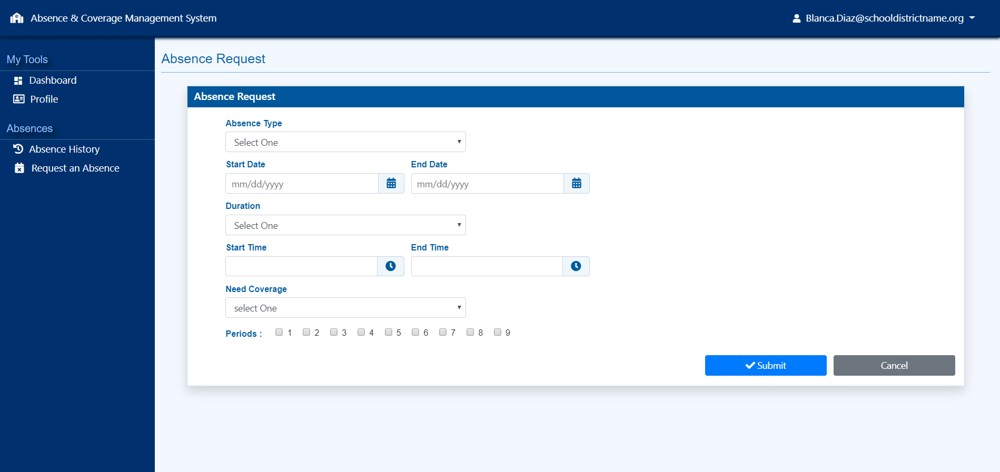
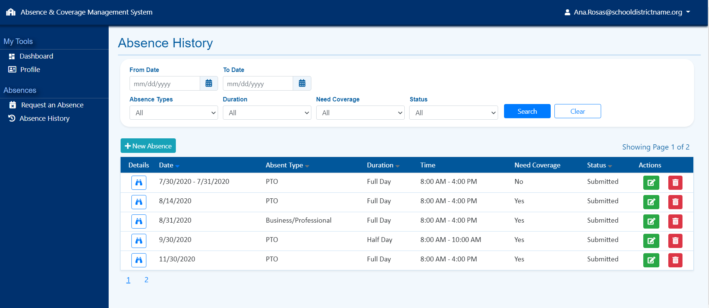

# Absence & Coverage Management System
A simple absence and coverage management system, build to help school district manage both employee absences, and class coverage if needed at a campus level. Through this application, school personal will be able to submit absence requests electronically, managers will be able to approve or deny those absence requests, and if coverage is needed sub-teachers will be able to accept jobs that become available due to approved teacher absences.

## Introduction 
This project was created to consolidate employee absence requests and coverage in one place. The idea for the project was inspired by my past experience working at a school district and assisting with the management of both PTO requests and coverage. In addtion, implementing this project served as an opportunity to practice what I learned reading about .NET Core. 

## Utilized 
This project was created utilizing the following technologies: 

* .NET Core 3.1 
* Microsoft Entity Framework Core 3.1 
* C#
* CSS 
* HTML
* Bootstrap 4
* JQuery 3.4.1
* JQuery-UI 1.12.1
* JQuery-Timepicker 1.10.0
* Visual Studio 

## Functionalities 
This project is expected to have the following functionalities for the following types of users. 

* Admin - Manage Users 
* Admin Manage Roles 
*	Admin – Manage Absence Types 
*	PowerUser – Manage Absence Requests 
*	PowerUser – Manage Coverage 
*	SubTeacher – Sub Job History 
*	SubTeacher – Available Sub Jobs 
*	User – Request an Absence 
*	User – Absence History 
*	User – User Profile Settings 
* User - Dashboard
* User - Login

## Screen Shots

User - Request An Absence 

User - Absence History

## Author 
Marilin Ortuno

## Project Status 
Completed

